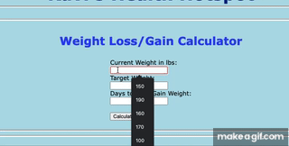
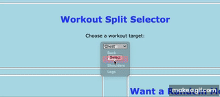
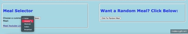

# Ravi's Health Hotspot

>Get Started Lifting Weights and Eating Healthy 

## Webpage Goal

The goal of this webpage is to provide users the ability to help attain their `fitness` and `nutrition` goals. The two key areas to prioritize when attempting to live a health-conscious lifestyle are physical activity and eating healthy. This webpage provides basic tools to help improve those areas of the user's lifestyle. 

## Features

- Estimate weight gain/loss goals over certain periods of time
- Pick from a handful of pre-determined health-conscious meals, and provides a YouTube tutorial on how to make those meals
- Access the [The MealDB Random Meal Database](https://www.themealdb.com/api/json/v1/1/random.php) in order to gain more meal inspiration
- Pick a training program for lifting weights based off of the muscle group that needs to be targeted

## How to Use

***There are three main sections to this webpage: Weight Calculator Section, Workout Selection Section, Meal Selection Section.***

1. ***To use the Weight Calculator Section, input your current weight, target weight, and days expected to achieve this goal. This will calculate the amount of lbs expected to lose per week to meet your weight goals.***

> 

2. ***To use the Workout Selection Section, choose the target muscle group and click the `Select` button. This will provide a list of four exercises the user can use to workout that specific muscle group.***

> 

3. ***The Meal Selection Section has two parts: a pre-determined meal list and a random meal generator. The first section will provide a variety of different cuisines, as well as the Youtube link associated with preparing that meal. The second section is a random meal generator connected to the Meal DB random recipe API. This section will provide a random cuisine, as well as a meal name and website with the meal recipe.***

>

## Technologies used

The technologies used are: 

- JavaScript  
- [MealDB API](https://www.themealdb.com/api/json/v1/1/random.php) 

